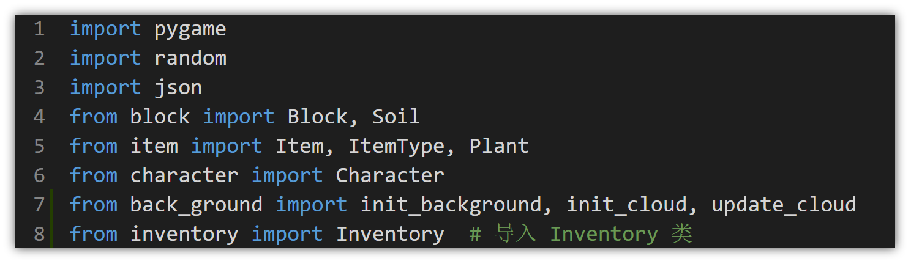
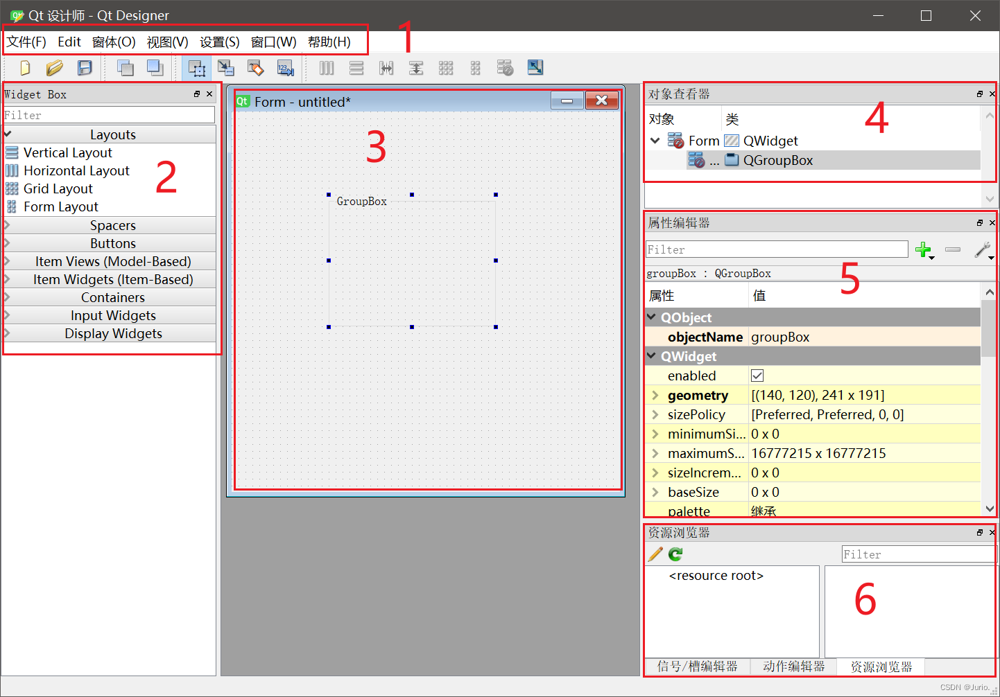

预备知识：Python基础，面向对象的编程思想

# 库以及pip工具
>注：如果在安装Python的时候没有勾选pip以及将pip添加到环境变量可能会导致输入pip指令没有反应，最简单的方法是用python安装包modify一下或者重新安装

## 一、pip工具
1. **pip是什么**：Python官方的第三方库管理工具，能一键安装/卸载PySide6这类非Python自带的库；
   - **进阶建议**: 如果你希望更优雅地管理不同项目的库，避免版本冲突，建议使用 Miniconda 进行环境隔离。详细教程请参考 [CONDA_GUIDE.md](CONDA_GUIDE.md)。
2. **核心命令**：
   - 查版本（验证是否安装）：`pip --version`；
   - 装PyQt相关库：`pip install pyside6`；
   - 解决下载慢：临时换清华源 `pip install pyside6 -i https://pypi.tuna.tsinghua.edu.cn/simple/`；

## 二、Python导入库
1. **核心逻辑**：把装好在电脑里的库/模块，“拿”到代码里用；
2. **3种常用方式（结合PySide6举例）**：
   - 直接导入：`import PySide6.QtWidgets`（完整路径，略繁琐）；
   - 导入指定模块：`from PySide6.QtWidgets import QWidget, QPushButton`（常用，只拿需要的）；
   - 别名简化：`import PySide6.QtWidgets as qtw`（写代码更省事）；




# PySide6
PyQt和PySide是Python调用Qt框架的两款GUI开发库，本教程使用Qt官方支持的 **PySide6**。

**联系**是：功能、语法高度一致，都能实现跨平台界面开发，版本也对应Qt（比如PySide6适配Qt6）。

**区别**核心在三点：1. 开发商：PyQt是第三方公司做的，PySide是Qt官方工具；2. 协议：PyQt用GPL（闭源商用需付费），PySide用LGPL（闭源商用更宽松）；3. 细节：PyQt信号写`pyqtSignal`，PySide是`Signal`，UI转代码的工具名也略有不同。

二者切换成本很低，学会一个就能快速适配另一个。

[Qt官网；](qt.io)

[PySide6 文档；](https://doc.qt.io/qtforpython-6/index.html)

## 简介
PySide6 是一个用于创建图形用户界面（GUI）的强大工具包，基于 Qt 框架。它允许开发者使用 Python 语言来构建跨平台的桌面应用程序。PySide6 提供了丰富的控件和功能，使得开发复杂的 GUI 应用变得更加简单和高效。

## 教学目标
1. 理解 PySide6 的基本概念和架构。
2. 掌握 PySide6 的安装和配置方法。
3. 能够完成一个小车的图形上位机编写

## 课前准备
1. 安装 Python 和 PySide6 库。
2. 安装 Qt Designer 等相关工具

## 教学内容
### 一， PySide6 基本机制

#### 1. **信号与槽（Signals & Slots）—— 组件交互的核心**
这是PySide6最独特、最核心的机制，用于实现**组件之间的通信**（比如“按钮被点击后执行某个操作”）。

- **信号（Signal）**：组件在特定事件发生时发出的“通知”。  
  例如：按钮被点击（`clicked`信号）、输入框内容变化（`textChanged`信号）、窗口关闭（`closed`信号）等，这些信号由PySide6自动定义，无需手动编写。

- **槽（Slot）**：用于接收并处理信号的函数（可以是自定义函数）。  
  例如：点击按钮后弹出提示框、输入框内容变化时更新显示等，这些功能都可以写成槽函数。

- **关联方式**：通过`connect()`方法将信号与槽绑定，形成“事件触发→响应”的关系。  

  **简单例子**：  
```python
import sys
from PySide6.QtWidgets import QApplication, QPushButton, QMessageBox

def show_message():  # 自定义槽函数
    QMessageBox.information(None, "提示", "按钮被点击了！")

app = QApplication(sys.argv)
button = QPushButton("点击我")  # 创建按钮组件
button.clicked.connect(show_message)  # 将按钮的clicked信号与槽函数关联
button.show()
app.exec()  # 启动事件循环
```
  当按钮被点击时，`clicked`信号被触发，自动调用`show_message`槽函数，弹出提示框。

#### 2. **事件循环（Event Loop）—— 程序运行的“心脏”**
PySide6程序的运行依赖于**事件循环**，它是一个持续运行的“循环”，负责监听和处理所有用户操作（如点击、输入、窗口大小变化等）。

- **工作流程**：  
  1. 程序启动时，通过`QApplication.exec()`启动事件循环；  
  2. 循环不断“等待”用户操作（事件），一旦有事件发生（如点击按钮），就将事件分发给对应的组件处理；  
  3. 处理完成后，继续等待下一个事件，直到程序被关闭（如点击窗口关闭按钮），循环才会结束。

- **为什么需要它**：  
  没有事件循环，程序会执行完代码后直接退出，无法响应用户操作。比如上面的例子中，`app.exec()`是必不可少的，否则窗口会一闪而过。


#### 3. **组件模型（Widget Hierarchy）—— UI元素的“家族树”**
PySide6的所有可视化元素（按钮、窗口、输入框等）都基于**QWidget**类（基础组件类），形成一套清晰的继承关系（类似“家族树”）。

>这幅图片仅为示意图，内容并不完善
- **核心特点**：  
  - 所有UI组件都是`QWidget`的子类（或间接子类），例如：  
    - `QPushButton`（按钮）继承自`QAbstractButton`，而`QAbstractButton`又继承自`QWidget`；  
    - `QMainWindow`（主窗口）直接继承自`QWidget`。  
  - 组件可以“嵌套”：一个组件可以作为另一个组件的“父组件”（如窗口是按钮的父组件），父组件被删除时，子组件会自动被删除，避免内存泄漏。


- **好处**：  
  统一的继承体系让所有组件拥有共同的基础功能（如显示、隐藏、设置大小等），同时各自扩展独特功能（如按钮的点击、输入框的文本编辑），方便学习和使用。

  
#### 4. **布局管理（Layout Management）—— 自动排列组件的“智能管家”**
手动设置组件的位置和大小（如`setGeometry(x, y, width, height)`）很繁琐，且窗口大小变化时组件会错位。PySide6的**布局管理器**能自动管理组件的位置和大小，让界面更灵活。

- **常用布局**：  
  - `QVBoxLayout`：垂直布局（组件从上到下排列）；  
  - `QHBoxLayout`：水平布局（组件从左到右排列）；  
  - `QGridLayout`：网格布局（组件按行列排列，类似表格）。

- **例子**：用垂直布局排列两个按钮，窗口大小变化时按钮会自动适应：  
  ```python
  from PySide6.QtWidgets import QApplication, QWidget, QPushButton, QVBoxLayout

  app = QApplication([])
  window = QWidget()
  layout = QVBoxLayout()  # 创建垂直布局

  # 向布局中添加组件
  layout.addWidget(QPushButton("按钮1"))
  layout.addWidget(QPushButton("按钮2"))

  window.setLayout(layout)  # 为窗口设置布局
  window.show()
  app.exec()
  ```

### 二， QtDesigner
正确安装了PySide6之后会自动安装一系列所需要的工具，包括QtDesigner。
QtDesigner的路径通常在`~\miniconda3\envs\test\Lib\site-packages\PySide6\designer.exe` (具体路径取决于你的环境)
[PySide6 界面设计工具 QtDesigner 详细使用](https://blog.csdn.net/weixin_51715424/article/details/127573052)
#### 1. **简介**
- QtDesigner是一个可视化的界面设计工具，用于快速创建PySide6的UI界面。它提供了拖放组件、布局管理、信号槽关联等功能，极大简化了界面设计的过程。
#### 2. 界面简介
  
1. 顶部菜单栏：操作入口
截图顶部显示了标准的菜单栏，包含常用操作入口，新生需重点关注3个核心菜单：
- **文件(F)**：负责UI文件的基础操作，如“新建窗体”（选择基于`QWidget`/`QMainWindow`等载体）、“保存”（将设计存为`.ui`文件）、“打开”（编辑已有UI）。
- **窗体(O)**：核心用于“布局管理”，比如选中控件后，通过“垂直布局”“水平布局”快速让控件自动排列，避免手动调整位置。
- **帮助(H)**：提供Qt Designer的基础教程，新手遇到控件用法问题时可查阅。

2. 存放所有可拖拽的UI组件，按功能分类：
- **Layouts**：布局管理器（垂直/水平/网格/表单布局），先拖布局再放控件，自动对齐；
- **Buttons**：按钮（如`QPushButton`）；
- **Containers**：容器（如截图中的`QGroupBox`，用于分组控件，比如把"用户名+密码输入框"放一组）；
- **Input Widgets**：输入控件（如文本框`QLineEdit`、下拉框`QComboBox`）。 

3. 中间设计区：可视化画布
截图中间的“Qt Form - untitled*”是核心设计区，当前展示的是一个**基于`QWidget`的空白窗体**（标题“untitled”表示未保存），设计区中已添加：
- 1个`QGroupBox`（分组框，默认名`groupBox`）：用于“组件分组”，比如后续可在里面拖入“性别选择按钮组”“兴趣复选框组”，让UI更规整；
- 隐含的布局管理器：截图左侧`Widget Box`中显示了“Vertical Layout（垂直布局）”“Horizontal Layout（水平布局）”，说明当前可能已为`QGroupBox`或窗体设置了布局，后续拖入控件会自动按布局排列。

4. 对象查看器
- 显示当前UI中所有组件的“层级关系”（类似“文件树”），比如截图中“Form（父载体）→ groupBox（子组件）”，可快速选中组件、修改组件名（如把`groupBox`改名为`userGroup`）。
5. 属性编辑器
- 用于查看和修改选中组件的各种“属性”，例如：位置和大小（geometry）、文字内容（text）、字体和颜色（font / palette）、布局策略、是否可见/可用等，无需写代码即可完成界面微调。
6. 资源管理器
- 在“资源管理器”中管理UI中用到的各种“资源”（如图片、图标）：比如给按钮加图标时，先在这里导入图片文件并加入资源文件，再在“属性编辑器”的相应属性里选择该图片，避免在代码中手动处理文件路径。

还有两个选项卡，分别是动作编辑器以及槽/信号编辑器

7. 动作编辑器
- 管理菜单栏和工具栏的“动作”（Action），如“复制”、“粘贴”、“打开文件”等通用操作。
8. 槽/信号编辑器
- 可视化地连接组件的信号与槽，例如将“按钮点击”信号连接到“关闭窗口”槽，无需写这一部分代码。
#### 3. 导出UI文件
 


### 三， 如何使用.ui文件

1. 保存后会获得一个`.ui`文件，后续可以用`pyside6-uic`将其转换为Python代码。
```bash
pyside6-uic main.ui -o ui_main.py
```
1. 在你的程序中导入这个`ui_main.py`中的`Ui_MainWindow`类
```python
from ui_main import Ui_MainWindow
from PySide6.QtWidgets import QApplication, QMainWindow
import sys
```
1. 创建主窗口类
```python
class MainWindow(QMainWindow):
    def __init__(self):
        super().__init__()
        self.ui = Ui_MainWindow()
        self.ui.setupUi(self)
```
1. 运行应用
```python
if __name__ == "__main__":
    app = QApplication([])
    window = MainWindow()
    window.show()
    app.exec()
```
1. 需要注意的点
- 信号与槽的连接
  - 信号：组件的状态变化，如按钮点击、文本框输入等。
  - 槽：响应信号的函数，当信号触发时，会自动调用槽函数。
  - 连接：在代码中使用`connect`方法将信号与槽连接起来，例如：
    ```python
    self.ui.pushButton.clicked.connect(self.button_click)
    ```
    这表示当`pushButton`按钮被点击时，会调用`button_click`方法。
  - 槽函数的定义：在主窗口类中定义一个方法，用于响应信号。例如：
  - 同时也可以在designer中设置信号与槽的连接
    - 选中组件，在属性编辑器中找到`clicked`信号，点击`+`号添加槽函数。
    - 槽函数的定义：在主窗口类中定义一个方法，用于响应信号。
  - 推荐使用designer中设置信号与槽的连接，而不是在代码中设置。
  
- 为什么要使用designer生成ui文件，而不是直接在代码中编写ui，为什么ui界面要单独一个文件？
- 1. 可视化设计：designer提供拖拽组件、布局管理等功能，极大简化了界面设计过程。
- 2. 代码与界面分离：ui文件与业务逻辑代码分离，方便团队合作开发。
- 3. 代码生成：使用`pyside6-uic`工具可以将ui文件转换为Python代码，避免手动编写ui代码。

### 四， 综合案例：小车上位机界面设计
#### 1. 需求分析
- 设计一个简单的上位机界面，用于控制小车的运动和显示状态信息。
- 界面包括：
  - 小车运动控制按钮（前进、后退、左转、右转、停止）
  - 当前模式，机械臂位置
#### 2. 界面设计
- 使用QtDesigner设计界面，布局合理，易于操作。
- 包含一个`QGroupBox`，用于分组显示运动控制按钮。
- 包含一个`QLabel`，用于显示当前模式。
- 包含一个`QLabel`，用于显示机械臂位置。
- ……
#### 3. Designer实操
- 打开QtDesigner，创建一个新的窗体。
- 从左侧的组件库中拖拽组件到设计区，设置组件的属性。
- 使用布局管理器组织组件，比如使用垂直布局将按钮组垂直排列。
- 信号与槽的连接
 - 可以在designer中实现
 - 也可以在你的代码中实现
- 保存.ui文件，后续可以使用`pyside6-uic`将其转换为Python代码。
#### 4. 代码实现
- 导入生成的ui文件，创建主窗口类。
- 初始化ui组件。
- 实现按钮的槽函数，控制小车的运动。
- 实现其他组件的槽函数，更新状态信息。
- 运行应用。


## 总结
- 课程采取启发式教学，在有限的时间里采取以点带面的方式讲授，注重实践操作。
- 课程内容包括：
  - PySide6基础：组件的创建、布局、信号与槽的连接等。
  - 综合案例：小车上位机界面设计，涉及到信号与槽的连接、按钮的槽函数实现等。
- 时间限制省略的具体怎么使用上位机中python程序遥控小车的相关知识

# PySerial

``` 安装指令
pip install pyserial  # 临时换源：pip install pyserial -i https://pypi.tuna.tsinghua.edu.cn/simple/
```

示例程序
```python
import serial

# 打开串口
ser = serial.Serial('COM3', 9600, timeout=1)  # 根据实际情况修改串口号和波特率

# 发送数据
ser.write(b'Hello, World!\n')

# 接收数据
data = ser.readline()
print(data.decode().strip())

# 关闭串口
ser.close()
```
你希望我针对这个PySerial示例程序，通俗地讲解串口数据发送和接收的具体机制，帮助大一新生理解每一步的工作原理，以下是贴合新手认知的拆解：

### 一、程序整体功能
这个示例实现了“ Python程序 ↔ 单片机stm32 ”的串口双向通信：打开电脑COM3串口（波特率9600）→ 给硬件发一串数据 → 读取硬件返回的一行数据 → 关闭串口。

### 二、逐行拆解发送&接收机制
#### 1. 初始化串口：建立通信通道
```python
ser = serial.Serial('COM3', 9600)
```
- 这一步不只是“打开串口”，而是**建立Python与硬件串口的“约定好规则的通信通道”**：
  - `COM3`：指定电脑连接硬件的串口编号（硬件插不同USB口会变，这一点在使用串口助手时应该可以观察到）；
  - `9600`：波特率（数据传输的“速度”），必须和stm32设置的波特率完全一致，否则数据会乱码；
  - 同时初始化了**发送缓存**和**接收缓存**，为后续收发做准备。

#### 2. 发送数据：Python→硬件
```python
ser.write(b'Hello, World!\n')
```
这是串口发送的核心步骤，机制拆解：
- 串口通信的核心规则：**只能传输“字节流”（二进制），不能直接传字符串** → `b'...'`就是把字符串转成字节类型（`b`是byte的缩写）；
- `\n`：换行符，是人为加的“数据结束标记”，方便硬件识别“这是一整段完整数据”；
- 执行`write()`后：数据先进入PySerial的**发送缓存**，再由PySerial按9600波特率的速度，自动把字节流发送到硬件的串口接收端（硬件会从自己的接收缓存里读取这串数据）。

#### 3. 接收数据：硬件→Python
```python
data = ser.readline()
print(data.decode().strip())
```
这是串口接收的核心步骤，机制拆解：
- 硬件返回的数据先到串口芯片的**硬件缓存**，再被PySerial自动“搬”到Python端的**接收缓存**，和stm32里要有buffer列表时很相似的
- `readline()`：专门读取“直到遇到`\n`为止的一行数据”（对应发送时加的`\n`），从接收缓存里取出这整行字节。
- `data`是字节类型（如`b'Hi Python!\n'`），`decode()`把字节转回字符串，`strip()`去掉多余的换行/空格，方便打印查看。

#### 4. 关闭串口：释放资源
```python
ser.close()
```
- 关闭通信通道，释放串口占用（否则其他程序如串口助手无法使用该串口）；
- 同时清空发送/接收缓存里的残留数据，避免下次使用时出问题。

### 三、核心机制总结
1. 串口通信只能传**字节**：发送前用`b''`转字节，接收后用`decode()`转回字符串；
2. 收发靠“缓存中转”：数据不会直接传，先存缓存再按波特率传输；
3. `\n`是关键标记：发送时加、接收用`readline()`读，能准确识别“一段完整数据”；
4. 波特率必须一致：这是通信的“速度约定”，不一致会导致数据乱码。

# Pygame.joystick

用于获取游戏手柄（如 Xbox 或 PS 手柄，国产手柄大多属于xbox手柄，手柄几十块钱可以选择购入也可以选择使用键盘操作）的输入数据，常用于遥控控制。

``` 安装指令
pip install pygame  # 临时换源：pip install pygame -i https://pypi.tuna.tsinghua.edu.cn/simple/
```

### 示例程序
```python
import pygame
import time

# 初始化 pygame 和手柄模块
pygame.init()
pygame.joystick.init()

# 检查是否有手柄连接
if pygame.joystick.get_count() > 0:
    # 获取第一个手柄
    joystick = pygame.joystick.Joystick(0)
    joystick.init()
    print(f"检测到手柄: {joystick.get_name()}")

    try:
        while True:
            # 必须处理事件队列，否则手柄数据不会更新
            pygame.event.pump()

            # 获取摇杆数值 (返回 -1.0 到 1.0)
            # 通常 0: 左摇杆左右, 1: 左摇杆上下
            x_axis = joystick.get_axis(0)
            y_axis = joystick.get_axis(1)

            # 获取按键状态 (0 代表未按下, 1 代表按下)
            button_a = joystick.get_button(0)

            print(f"X轴: {x_axis:.2f}, Y轴: {y_axis:.2f}, A键状态: {button_a}")
            time.sleep(0.1)
    except KeyboardInterrupt:
        print("停止读取")
else:
    print("未检测到手柄，请检查连接")

pygame.quit()
```

### 核心机制
1. **必须初始化**：除了 `pygame.init()`，还必须显式调用 `pygame.joystick.init()`。
2. **事件刷新（Pump）**：在循环中必须调用 `pygame.event.pump()`。这是新手最容易忘的一步，如果不调用，程序就无法感知手柄数据的实时变化。
3. **轴（Axis）与按键（Button）**：
   - **轴**：通常是摇杆或线性扳机。数值在 `-1.0` 到 `1.0` 之间，向上/左通常为负，向下/右通常为正。
   - **按键**：离散状态，非 `0` 即 `1`。
4. **映射关系**：不同品牌的硬件（Xbox, PS, 飞智等）键位索引不同，使用前务必运行示例测出对应的索引号。

# Pygame.key (键盘控制)

对于没有手柄的同学，键盘就是最好的替代方案。通过编程，你可以将键盘的 **W/A/S/D** 或 **方向键** 映射为小车的运动指令。

- **自学提示**：可以尝试研究 `pygame.key.get_pressed()` 以及 `pygame.event` 队列中的 `KEYDOWN` 事件，看看它们在处理“长按”和“单词触发”时有什么不同。
- [pygame文档](https://www.pygame.org/docs/)
---
现在，你已经学会了**使用PySide6完成图形化的ui界面**，**使用PySerial完成串口收发**，**使用joystick接收手柄的数据**，接下来请你尝试将这三者混合起来，完成**E唯杯智能车竞赛**的**上位机**制作

---

附：
| 命令 | 作用 |
|------|------|
| `conda --version` | 验证Miniconda是否安装成功 |
| `conda create -n pyside6_env python=3.9 -y` | 创建名为pyside6_env、Python3.9的虚拟环境 |
| `conda activate pyside6_env` | 激活pyside6_env虚拟环境 |
| `pip install pyside6 -i https://pypi.tuna.tsinghua.edu.cn/simple/` | 换清华源安装PySide6及配套工具 |
| `pip install pyserial -i https://pypi.tuna.tsinghua.edu.cn/simple/` | 换清华源安装PySerial串口库 |
| `pyside6-uic main.ui -o ui_main.py` | 将Qt Designer设计的.ui文件转换为Python代码 |


系统变量配置：
- **Python 可执行目录**：包含 `python.exe`，例如 `C:\Python39\` 或 `C:\Users\<你>\AppData\Local\Programs\Python\Python39\`
- **Scripts 目录**：包含 `pip`、`pyside6-uic.exe` 等工具，例如 `C:\Python39\Scripts\` 或 虚拟环境的 `<env>\Scripts\`
- **（可选）PySide6 的 Qt 工具目录**：包含 `designer.exe`，例如 `...\Lib\site-packages\PySide6`
- **Anaconda/Miniconda 用户**：可加入根目录与 `Scripts`，例如 `C:\Users\<你>\anaconda3\` 和 `C:\Users\<你>\anaconda3\Scripts\`


